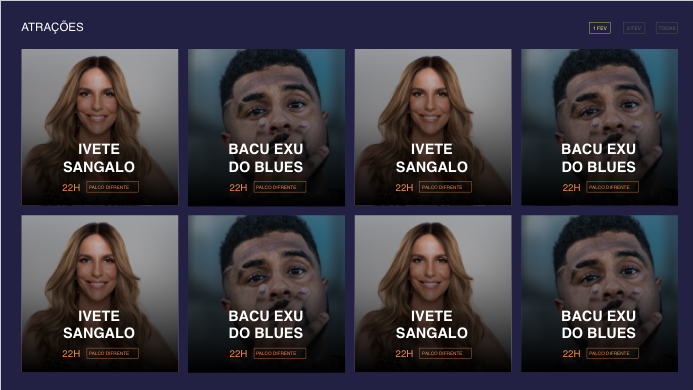

# Atracoes Challenge

This application used to allow users to see every single artist from the FV20 lineup. It also used to allow users to filter these artist by day.

Important parts of it were intentionally deleted. We want you to rewrite the deleted parts so that this applications works again.

## What needs to be done?

You have a few tasks. Although it used to be a working application, important parts and functions of it were partially removed but we kept its type signatures to make it easier for you.

It's a simple application that fetches data from the API and then show it in a grid system with a simple day filter.

## Prerequisites

Before you begin, make sure your development environment includes Node.js and an npm package manager

Install the Angular CLI globally. To install the CLI using npm, open a terminal/console window and enter the following command:

`$ npm install -g @angular/cli`

## Component styling

The styling for the `card-atracao` component were removed, so that we can test your ability to write it again just from the screenshot bellow.
Same for the main style. You **must** check the `_variables.scss` file under `assets/sass` to get the project colors and font-sizes.

There's a small detail you must stick to. The fonts used into the project are not shown in the screenshot bellow but you **must** use it. Check the `_fonts.scss` file under `assets/sass` to get more information about it.

Oh! Almost forgot about it: The base HTML sctructure for the grid is empty so you must code it from the ground zero. But don't worry, the HTML markup for the `card-atracao` and `tag` components are working fine but without any styling.

## Development server

Run `$ ng serve` for a dev server. Navigate to `http://localhost:4200/`. The app will automatically reload if you change any of the source files.

Oh! And don't forget to install the dependencies as the very first step!

OBS.: As it is done **DO NOT** send a PR. Just zip the project without the dependencies and send it by email.

# Further information

Before you go, you'd better read/learn/remember a few subjects about JavaScript and Angular:

#### Angular 
- Template Sintax and interpolation
- Components
- Models
- Services

#### JavaScript
- Manipulating Arrays and Objects
  - Especially Filter
